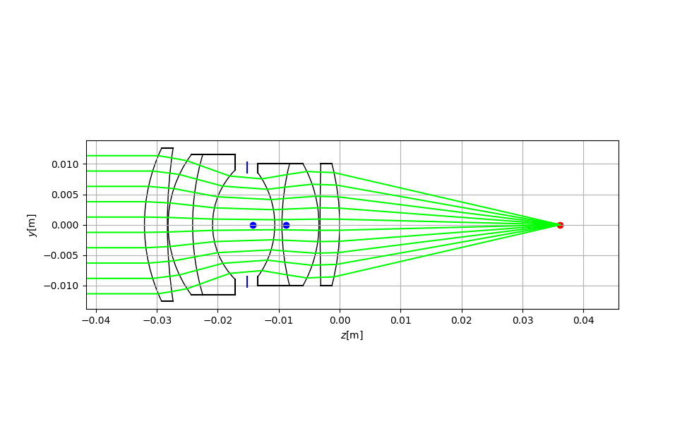
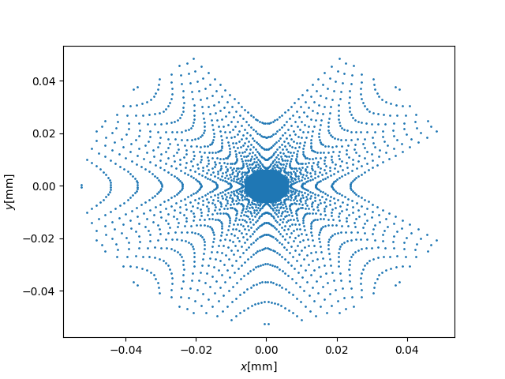
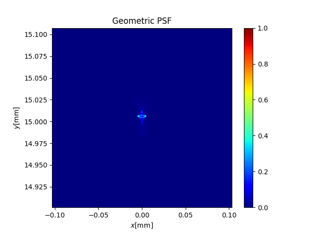

# LensSim

LensSim is a C++ library and GUI tool for photographic lens system.

It's goal is to make C++ library for optical computations in lens design, and make user-friendly Python GUI tool to help lens design tasks.

LensSim can simulate image of photographic lens with Image Based Lighting(IBL) by Montecarlo Light Transportation.

## Gallery

### Spectral Rendering with Image Based Lighting(IBL)

Rendering of double gauss lens(`data/dgauss50mm.json`). 

You can see some aberrations like chromatic aberration, and lens flare.

see `src/main.cpp`


### Optical Path Diagram

see `python/example.py`



### Spot Diagram

Spot Diagram of `data/dgauss50mm.json`



### Geometric PSF

Geometric Point Spread Function(PSF) of `data/dgauss50mm.json`




## Features

- [x] Ray Tracing
- [x] Focusing
- [x] Sampling Ray from Exit Pupil
- [x] Vignetting
- [x] Lens Flare
- [x] Chromatic Aberration
- [x] Paraxial Ray Tracing
- [x] Spectral Rendering with IBL
- [x] Python Binding
- [x] Spot Diagram
- [x] Geometric Point Spread Function(PSF)
- [ ] Geometric Optical Transfer Function(OTF), Modulation Transfer Function(MTF)
- [ ] Wavefront Aberration
- [ ] Zernike Polynomial
- [ ] Diffraction Point Spread Function(PSF)
- [ ] Diffraction Optical Transfer Function(OTF), Modulation Transfer Function(MTF)

### Supported Lens Element

- [x] Aperture
- [x] Spherical Lens
- [ ] Aspheric Lens

## Requirements

* C++17
* CMake 3.12 or Higher

## Setup

```
git submodule update --init
```

## Build

```
mkdir build
cd build
cmake -DCMAKE_BUILD_TYPE=Release ..
make
```
## Python Binding

See `python/example.py`


## Externals

* [progschj/ThreadPool](https://github.com/progschj/ThreadPool) - zlib License
* [nlohmann/json](https://github.com/nlohmann/json) - MIT License
* [nothings/stb](https://github.com/nothings/stb) - Public Domain or MIT License 
* [syoyo/tinyexr](https://github.com/syoyo/tinyexr) - 3-clause BSD License
* [pybind/pybind11](https://github.com/pybind/pybind11) - BSD-style license 
